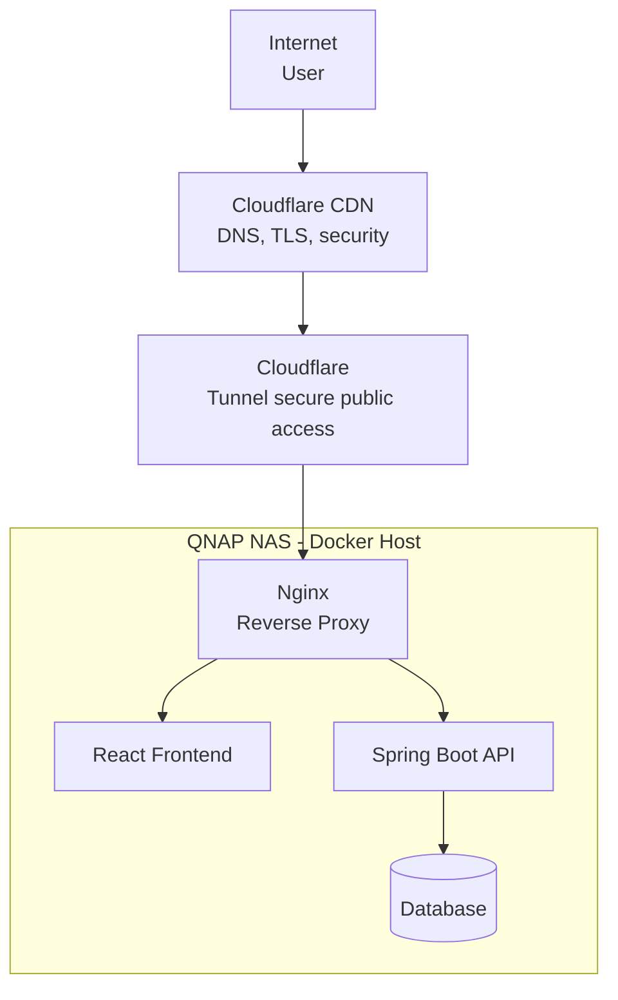
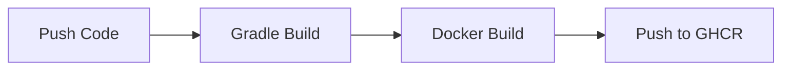
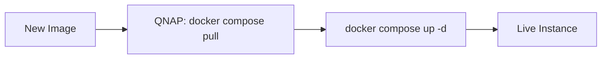

```mermaid
erDiagram

POET ||--o{ POEM : writes
POEM ||--o{ RECORDING : has
ACTOR ||--o{ RECORDING : performs

POET {
  Long id
  String name
  String bio
}

POEM {
  Long id
  String title
  Text text
  Long poet_id
}

ACTOR {
  Long id
  String name
  String bio
}

RECORDING {
  Long id
  Long poem_id
  Long actor_id
  String audio_url
  Integer start_time_sec
}
```

# PoetryStream

PoetryStream to edukacyjna platforma cyfrowa popularyzująca poezję poprzez profesjonalne interpretacje aktorskie oraz interaktywne formy odbioru literatury.
PoetryStream wykorzystuje nowoczesne technologie, by ułatwić dostęp do literatury klasycznej poprzez materiały audio, interaktywne rozwiązania i dystrybucję cyfrową.

Projekt łączy technologię Java + Spring Boot z frontem React, umożliwiając słuchanie wierszy, wyświetlanie zsynchronizowanego tekstu i poznawanie sylwetek autorów i aktorów.

---

## 📌 Project Overview

PoetryStream is an educational audio streaming platform for poetry and literary works built with Java 21 and Spring Boot.
PoetryStream explores how modern technology can make classical literature more accessible through audio, interactivity and digital distribution.

PoetryStream is a modular backend-driven platform designed to deliver high-quality audio recordings of poetry and literary works.\
Architecture designed as a containerized modular monolith with secure public access via Cloudflare Tunnel.\
Repository organized as a modular monolith with clear domain separation (controller → service → repository).

---

## 🚀 Tech Highlights

- Full CI/CD pipeline (GitHub Actions → GHCR → self-hosted QNAP)
- Containerized deployment (Docker Compose)
- Secure public access via Cloudflare Tunnel (no open ports)
- Modular monolith architecture (Spring Boot)
- Production-ready PostgreSQL + Flyway migrations
- React + TypeScript frontend with audio streaming

---

## 🖥 Infrastructure Details

- Self-hosted on QNAP NAS
- Dockerized services (PostgreSQL, Backend, Frontend, Cloudflare Tunnel)
- Automated deployment via GitHub Actions + SSH
- Zero exposed ports (Cloudflare Tunnel only)

---

## 🎯 Misja

- Popularyzacja poezji i literatury w środowisku cyfrowym  
- Wsparcie twórców i aktorów  
- Tworzenie nowoczesnego narzędzia edukacyjnego  
- Integracja środowiska kultury i edukacji  

Status: **Production-ready MVP deployed on live infrastructure**

---

## ☁️ Deployment

### Publiczna instancja testowa:  
👉 https://poetrystream.qzz.io/

PoetryStream działa na lekkiej infrastrukturze self-hosted.

### 🔍 Sprawdź wdrożenie

```bash
https://poetrystream.qzz.io/actuator/health
https://poetrystream.qzz.io/actuator/info
```

## 🏗 System Architecture



Nginx działa również jako **reverse proxy**, dzięki czemu frontend komunikuje się z API przez:

```bash
/api/*
```

Takie podejście upraszcza konfigurację środowisk oraz zwiększa bezpieczeństwo (brak otwartych portów na serwerze).

---

## ⚙️ CI/CD & DevOps

### Etap CI: Budowanie i Testy


### Etap CD: Wdrożenie

Security & Secrets: Wszystkie klucze dostępowe (SSH, API Tokens) są zarządzane przez zaszyfrowane mechanizmy GitHub Secrets.

---

## 🧱 Architektura MVP

### Backend
- Java 21  
- Spring Boot 4.0.2  
- REST API (nagrania, autorzy, aktorzy)  
- Spring Data JPA + Hibernate  
- H2 (środowisko developerskie)  
- Flyway (wersjonowanie migracji)  
- Gradle (Groovy DSL)  

Warstwowa architektura:
controller → service → repository → domain + DTO + mapper

### Frontend
- React 18 + TypeScript  
- Vite  
- Tailwind CSS  
- Audio API / Howler.js  

### Infrastruktura
- Docker
- Nginx
- Cloudflare Tunnel
- QNAP NAS

---

## 🔊 Funkcjonalności MVP

- Lista nagrań (wiersze czytane przez aktorów)  
- Profil autora i aktora  
- Odtwarzacz audio  
- Synchronizowany tekst  
- Publiczny dostęp bez logowania  

---

## 📡 API & Dokumentacja

Backend udostępnia REST API - pełny CRUD z MapStruct dla Actor, Poet, Poem i Recording.

Planowane rozszerzenia:

- Integracja z OpenAPI / Swagger UI  
- Automatyczna dokumentacja endpointów  
- Standaryzacja odpowiedzi (ResponseEntity + global handler)  
- Wersjonowanie API (np. /api/v1)

Docelowo API będzie gotowe do integracji z aplikacją mobilną oraz usługami zewnętrznymi.

---

## 🔐 Bezpieczeństwo (planowane)

Wersja MVP działa bez uwierzytelniania (publiczny dostęp do treści).

Aplikacja publiczna jest chroniona przez:

- Cloudflare CDN
- Cloudflare Tunnel (no open server ports)
- Nginx reverse proxy
- Container isolation (Docker)

W kolejnych etapach planowane:

- JWT Authentication  
- Role użytkowników (ADMIN / EDUKATOR / USER)  
- Ochrona endpointów administracyjnych  
- Walidacja danych wejściowych  
- Globalny handler wyjątków  

---

## 🌍 Internacjonalizacja (i18n)

Platforma projektowana jest z myślą o obsłudze wielu języków.

Planowane rozwiązania:

- Backend: Spring MessageSource  
- Frontend: mechanizm i18n (React i18next)  
- Możliwość dynamicznego przełączania języka  
- Wsparcie dla środowisk polonijnych  

---

## 🧩 Skalowalność i kierunek architektoniczny

- Modularny monolit z podziałem domenowym  
- Migracja z H2 do PostgreSQL w środowisku produkcyjnym  
- Konteneryzacja (Docker)  
- Możliwość integracji z zewnętrznym storage dla plików audio  
- Przygotowanie pod przyszłe wydzielenie mikroserwisów

---

### ▶ Uruchomienie lokalne

### 🚀 Quick Start

## Run with Docker

```bash
git clone https://github.com/your-repo/poetrystream.git
cd poetrystream

docker compose up -d
```

### Backend
```bash
cd backend
./gradlew bootRun
```

> Uwaga: profil `prod` oczekuje PostgreSQL. Poza Docker Compose ustaw host na lokalny serwer, np.
> `DB_HOST=localhost DB_PORT=5432 DB_NAME=poetrystream DB_USERNAME=poetry DB_PASSWORD=poetrypassword`.

- API dostępne na: http://localhost:8080  
- H2 Console: http://localhost:8080/h2-console  
(JDBC URL: jdbc:h2:file:./data/poetrydb, user: sa, pass: )  

---

### Swagger UI:
```bash
http://localhost:8080/swagger-ui/index.html
```

---

### Health check:
```bash
http://localhost:8080/actuator/health
```

---

### Frontend
```bash
cd frontend
npm install
npm run dev
```

- Frontend: http://localhost:5173  

---

### Available Endpoints (MVP)
```bash
recording

GET /api/recordings
GET /api/recordings/{id}
GET /api/recordings/{id}/karaoke

poet

GET /api/poets
GET /api/poets/{id}

poem

GET /api/poems
GET /api/poems/{id}

actor

GET /api/actors
GET /api/actors/{id}
```

---

## 🚀 Plan rozwoju

### Etap 1 – Stabilizacja MVP
- Ukończenie integracji frontend–backend  
- Deployment środowiska testowego&emsp;&emsp;&emsp;👈
- Walidacja danych, DTO, MapStruct  
- CORS Config
- Wyjątki - GlobalExceptionHandler, ResourceNotFoundException
- Przygotowanie pod PostgreSQL  

---

### Etap 2 – Rozszerzenie edukacyjne
- Rozbudowane profile autorów i aktorów  
- Kategorie tematyczne i epoki literackie  
- Quizy literackie dla szkół  
- Panel administracyjny  

---

### Etap 3 – Komponent społecznościowy
- Konta użytkowników  
- System ocen i komentarzy  
- Playlisty tematyczne  
- Historia odsłuchań i postępy  

---

### Etap 4 – Integracja instytucjonalna
- Informacje o wydarzeniach literackich  
- Współpraca z teatrami i bibliotekami  
- Kalendarz wydarzeń  

---

### Etap 5 – Transmisje na żywo
- Streaming wydarzeń literackich  
- Archiwizacja transmisji  
- Interakcja użytkowników (chat)  

---

### Etap 6 – Wersja mobilna
- Aplikacja React Native  
- Tryb offline  
- Powiadomienia o wydarzeniach  

---

## 🌍 Kierunek rozwoju

PoetryStream projektowany jest jako:

- cyfrowa biblioteka poezji audio  
- platforma edukacyjna dla szkół  
- narzędzie promocji aktorów i twórców  
- przestrzeń współpracy z instytucjami kultury  
- platforma możliwa do wdrożenia również dla środowisk polonijnych  

---

## 🧱 Struktura repozytorium (MVP w Javie + React)

```text
poetry-stream/
├─ backend/                         # Spring Boot backend
│  ├─ build.gradle                  # konfiguracja Gradle
│  ├─ src/
│  │  ├─ main/
│  │  │  ├─ java/com/poetrystream/backend/
│  │  │  │  ├─ BackendApplication.java
│  │  │  │  ├─ controller/
│  │  │  │  │  ├─ ActorController.java
│  │  │  │  │  ├─ PoetController.java
│  │  │  │  │  ├─ PoemController.java
│  │  │  │  │  └─ RecordingController.java
│  │  │  │  ├─ domain/
│  │  │  │  │  ├─ Actor.java
│  │  │  │  │  ├─ Poet.java
│  │  │  │  │  ├─ Poem.java
│  │  │  │  │  ├─ Recording.java
│  │  │  │  │  └─ RecordingStatus.java
│  │  │  │  ├─ dto/
│  │  │  │  │  ├─ ActorDto.java
│  │  │  │  │  ├─ PoetDto.java
│  │  │  │  │  ├─ PoemDto.java
│  │  │  │  │  ├─ RecordingDto.java
│  │  │  │  │  └─ RecordingKaraokeDto.java
│  │  │  │  ├─ exception/
│  │  │  │  │  ├─ GlobalExceptionHandler.java
│  │  │  │  │  └─ ResourceNotFoundException.java
│  │  │  │  ├─ mapper/
│  │  │  │  │  ├─ ActorMapper.java
│  │  │  │  │  ├─ PoetMapper.java
│  │  │  │  │  ├─ PoemMapper.java
│  │  │  │  │  └─ RecordingMapper.java
│  │  │  │  ├─ repository/
│  │  │  │  │  ├─ ActorRepository.java
│  │  │  │  │  ├─ PoetRepository.java
│  │  │  │  │  ├─ PoemRepository.java
│  │  │  │  │  └─ RecordingRepository.java
│  │  │  │  └─ service/
│  │  │  │     ├─ ActorService.java
│  │  │  │     ├─ PoetService.java
│  │  │  │     ├─ PoemService.java
│  │  │  │     └─ RecordingService.java
│  │  └─ resources/
│  │     ├─ application.yaml        # konfiguracja (H2, Flyway)
│  │     └─ db/migration/           # migracje Flyway
│  └─ gradlew, gradlew.bat, settings.gradle
│
├─ frontend/                        # React + TypeScript
│  ├─ src/
│  │  ├─ App.tsx
│  │  ├─ index.tsx
│  │  └─ components/
│  │     └─ RecordingPlayer.tsx
│  ├─ package.json
│  ├─ tsconfig.json
│  └─ vite.config.ts
│
├─ .gitignore
└─ README.md
```


---

## 📈 Potencjalne modele finansowania

- Współpraca z bibliotekami i teatrami  
- Patronaty instytucji kultury  
- Subskrypcja premium (funkcje rozszerzone)  
- Granty krajowe i europejskie  

---

## 📚 Status projektu

Aktualna faza: MVP (Proof of Concept)  
Cel: rozwój do pełnoprawnej platformy edukacyjno-kulturalnej.