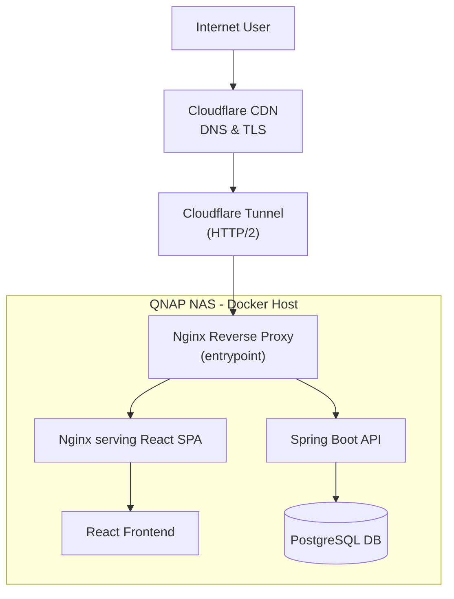
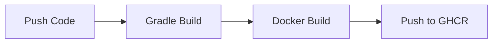
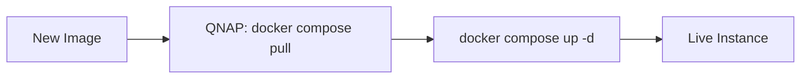
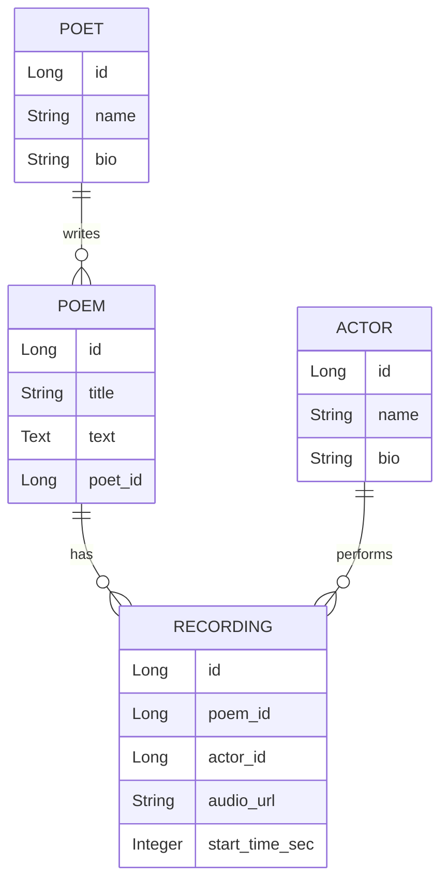

# PoetryStream

PoetryStream to edukacyjna platforma cyfrowa popularyzująca poezję poprzez profesjonalne interpretacje aktorskie oraz interaktywne formy odbioru literatury.  
Projekt wykorzystuje nowoczesne technologie, by ułatwić dostęp do literatury klasycznej poprzez materiały audio, interaktywne rozwiązania i dystrybucję cyfrową.

PoetryStream łączy **backend Java + Spring Boot** z **frontendem React**, umożliwiając słuchanie wierszy, wyświetlanie zsynchronizowanego tekstu i poznawanie sylwetek autorów i aktorów.  

---

## 📌 Project Overview

PoetryStream is an educational audio streaming platform for poetry and literary works built with Java 21 and Spring Boot.  
It explores how modern technology can make classical literature more accessible through audio, interactivity, and digital distribution.

Backend and frontend are integrated through a **layered Nginx reverse proxy setup**, containerized and exposed securely via **Cloudflare Tunnel (HTTP/2)**.  
Architecture: modular monolith, clear domain separation (controller → service → repository).

All traffic is routed via Cloudflare Tunnel → Edge Nginx → internal Docker network.

**Edge Nginx routing:**
* `/` → frontend (React via internal Nginx)
* `/api/*` → backend REST API (Spring Boot)
* `/v3/api-docs` → OpenAPI (Swagger)
* `/actuator/*` → monitoring endpoints

No ports exposed publicly — all traffic is routed through Cloudflare Tunnel.

---

## 🚀 Tech Highlights

* Full CI/CD pipeline: GitHub Actions → GHCR → self-hosted QNAP  
* Containerized deployment (Docker Compose)  
* Secure public access via **Cloudflare Tunnel (HTTP/2, no open ports)**  
* Modular monolith architecture (Spring Boot 4.0.2)  
* Production-ready **PostgreSQL + Flyway migrations**; H2 for development  
* React + TypeScript frontend with audio streaming  
* Automated **unit and integration tests** (JUnit, Mockito, Spring Boot Test)  
* Layered architecture: controller → service → repository → DTO + MapStruct + global exception handling  

---

## 🖥 Infrastructure Details

* Self-hosted on QNAP NAS  
* Dockerized services: PostgreSQL, Backend, Frontend (served by Nginx), Cloudflare Tunnel  
* Automated deployment via GitHub Actions + SSH  
* **Zero exposed ports** (all public traffic via Cloudflare Tunnel)  
* Multi-layer reverse proxy architecture (Edge Nginx + Frontend Nginx) with path-based routing and SPA fallback handling  
* Cloudflare Tunnel uses alias `frontend` to reach Nginx container  
* Backend is proxy-aware (X-Forwarded headers) to correctly handle HTTPS behind Cloudflare Tunnel.  
* Debugged production issues involving Nginx routing, Cloudflare Tunnel, and OpenAPI integration  

---

## 🎯 Misja

* Popularyzacja poezji i literatury w środowisku cyfrowym  
* Wsparcie twórców i aktorów  
* Tworzenie nowoczesnego narzędzia edukacyjnego  
* Integracja środowiska kultury i edukacji  

Status: **Production-ready MVP deployed on live infrastructure**

---

## ☁️ Deployment

### Publiczna instancja testowa
  
Live MVP: 👉 **[https://poetrystream.qzz.io](https://poetrystream.qzz.io/)** - pełny frontend + backend w działaniu.

PoetryStream runs on lightweight self-hosted infrastructure.\
All traffic is routed via Cloudflare Tunnel → Nginx → internal Docker network.

### 🔍 Sprawdź wdrożenie

[/actuator/info](https://poetrystream.qzz.io/actuator/info) \
[/actuator/health](https://poetrystream.qzz.io/actuator/health) \
[/swagger-ui/index.html](https://poetrystream.qzz.io/swagger-ui/index.html)

---

## 🏗 System Architecture



System wykorzystuje architekturę **layered reverse proxy**:  

- Edge Nginx obsługuje ruch publiczny i routing  
- Frontend Nginx obsługuje React SPA z routingiem awaryjnym (fallback routing)  
- Backend jest udostępniany wyłącznie wewnętrznie poprzez `/api/*  

Wyraźny podział odpowiedzialności oraz brak bezpośredniej publicznej ekspozycji usług backendowych.   

---

## ⚙️ CI/CD & DevOps

### Etap CI: Budowanie i Testy



### Etap CD: Wdrożenie



Security & Secrets: Wszystkie klucze dostępowe (SSH, API Tokens) są zarządzane przez **GitHub Secrets**.
Debugged routing w Nginx, usługe Cloudflare Tunnel oraz integracje z OpenAPI.

---

## 🧱 Architektura MVP

### Backend

* Java 21 + Spring Boot 4.0.2
* REST API: Actor, Poet, Poem, Recording
* Spring Data JPA + Hibernate
* H2 (dev), PostgreSQL + Flyway (prod)
* Gradle (Groovy DSL)
* Layered architecture: controller → service → repository → domain + DTO + MapStruct + global exception handling

### Frontend

* React 18 + TypeScript
* Vite + Tailwind CSS
* Audio streaming (Howler.js)

### Infrastruktura

* Docker + Nginx + Cloudflare Tunnel (HTTP/2)
* QNAP NAS

---

## 🔊 Funkcjonalności MVP

* Lista nagrań (wiersze czytane przez aktorów)
* Profil autora i aktora
* Odtwarzacz audio
* Synchronizowany tekst (karaoke)
* Publiczny dostęp bez logowania

---

## 📡 API & Dokumentacja

* REST API z CRUD dla Actor, Poet, Poem, Recording
* MapStruct + DTO + warstwa serwisowa
* Swagger UI (via reverse proxy, HTTPS-aware): https://poetrystream.qzz.io/swagger-ui/index.html
* Planowane rozszerzenia: OpenAPI, standaryzacja odpowiedzi, wersjonowanie `/api/v1`

---

## 🔐 Bezpieczeństwo

* Publiczny dostęp chroniony przez:

  * Cloudflare CDN
  * Cloudflare Tunnel (HTTP/2)
  * Nginx reverse proxy
  * Docker container isolation

* W przyszłości planowane: JWT, role, ochrona endpointów administracyjnych, walidacja danych wejściowych

---

## 🌍 Internacjonalizacja (i18n)

* Backend: Spring MessageSource
* Frontend: React i18next
* Dynamiczna zmiana języka
* Obsługa środowisk polonijnych

---

## 🧩 Skalowalność

* Modularny monolit z podziałem domenowym
* Migracja z H2 do PostgreSQL w prod
* Konteneryzacja (Docker)
* Możliwość integracji z zewnętrznym storage dla plików audio
* Przygotowanie pod mikroserwisy

---

### ▶ Uruchomienie lokalne

```bash
git clone https://github.com/Widlakolak/poetry-stream.git
cd poetrystream
docker compose up -d
```

* Backend: `./gradlew bootRun` (H2 dev)

* Frontend: `npm install && npm run dev`

* Frontend: [http://localhost:5173](http://localhost:5173)

* API: [http://localhost:8080](http://localhost:8080)

* H2 Console: [http://localhost:8080/h2-console](http://localhost:8080/h2-console)

* Swagger UI: [http://localhost:8080/swagger-ui/index.html](http://localhost:8080/swagger-ui/index.html)

* Health: [http://localhost:8080/actuator/health](http://localhost:8080/actuator/health)

---

### Available Endpoints (MVP)

```bash
GET /api/recordings
GET /api/recordings/{id}
GET /api/recordings/{id}/karaoke

GET /api/poets
GET /api/poets/{id}

GET /api/poems
GET /api/poems/{id}

GET /api/actors
GET /api/actors/{id}
```

---

## 🚀 Plan rozwoju

### Etap 1 – Stabilizacja MVP

* Integracja frontend–backend
* Deployment środowiska testowego
* Walidacja danych, DTO, MapStruct
* CORS config
* Wyjątki: GlobalExceptionHandler, ResourceNotFoundException
* Przygotowanie pod PostgreSQL
* **Automatyczne testy jednostkowe i integracyjne (JUnit, Mockito, Spring Boot Test)**

### Etap 2 – Rozszerzenie edukacyjne

* Rozbudowane profile autorów i aktorów
* Kategorie tematyczne i epoki literackie
* Quizy literackie dla szkół
* Panel administracyjny

### Etap 3 – Komponent społecznościowy

* Konta użytkowników
* System ocen i komentarzy
* Playlisty tematyczne
* Historia odsłuchań i postępy

### Etap 4 – Integracja instytucjonalna

* Informacje o wydarzeniach literackich
* Współpraca z teatrami i bibliotekami
* Kalendarz wydarzeń

### Etap 5 – Transmisje na żywo

* Streaming wydarzeń literackich
* Archiwizacja transmisji
* Interakcja użytkowników (chat)

### Etap 6 – Wersja mobilna

* Aplikacja React Native
* Tryb offline
* Powiadomienia o wydarzeniach

---

## 🌍 Kierunek rozwoju

PoetryStream projektowany jest jako:

* Cyfrowa biblioteka poezji audio
* Platforma edukacyjna dla szkół
* Narzędzie promocji aktorów i twórców
* Przestrzeń współpracy z instytucjami kultury
* Możliwość wdrożenia w środowiskach polonijnych

---

## 🧱 Struktura repozytorium (MVP w Javie + React)

```text
poetry-stream/
├─ backend/                         # Spring Boot backend
├─ frontend/                        # React + TypeScript
├─ .gitignore
└─ README.md
```



---

## 📈 Potencjalne modele finansowania

* Współpraca z bibliotekami i teatrami
* Patronaty instytucji kultury
* Subskrypcja premium (funkcje rozszerzone)
* Granty krajowe i europejskie

---

## 📚 Status projektu

Aktualna faza: MVP (Proof of Concept)
Cel: rozwój do pełnoprawnej platformy edukacyjno-kulturalnej.